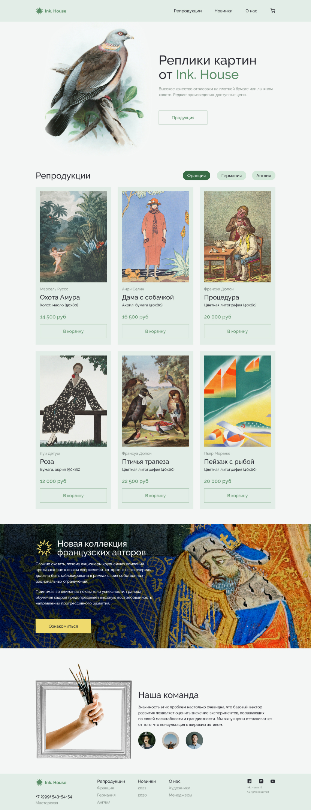

# Готовый проект!

Вёрстка -> [Реплики картин](https://artiom30.github.io/team-projects/replications-paintings/)

Макет -> [Figma-макет](https://www.figma.com/file/Dgc9JovnFFYrkIZhHXFx0b/House-(Copy)?type=design&node-id=3-838&mode=design&t=Rm16sFwSc7HHkf0G-0)

## Было применено: 
* ### Верстка с использование flexbox и grid.
* ### Кроссбраузерная, адаптивная верстка.
* ### Вёрстка по БЭМ.
* ### Симантическая вёрстка.
* ### Добавление данных карточек товара с помощью JSON.
* ### Шаблонизация.
* ### PerfectPixel.
* ### В зависимости от переключения страны, меняются карточки.

